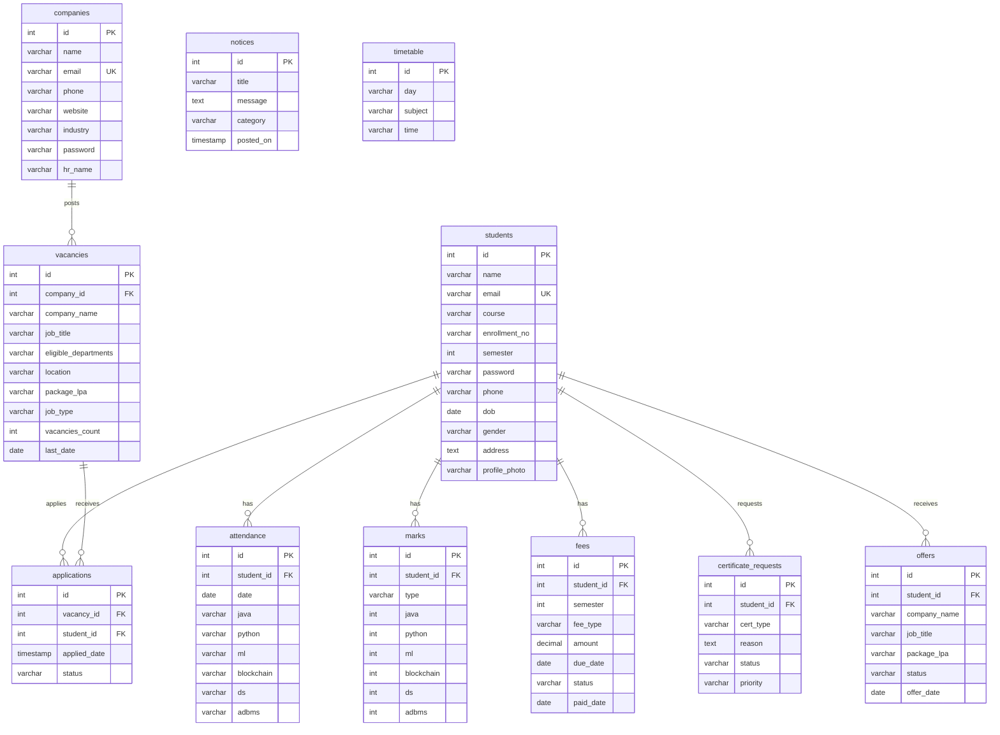

<p align="center">
  
</p>

<p align="center">
  <strong>A comprehensive, full-stack web application for managing academic operations, student records, attendance, examinations, fee management, and campus placements — all in one platform.</strong>
</p>

<p align="center">
  <a href="#-features"></a>
  <a href="#-tech-stack"></a>
  <a href="#-tech-stack"></a>
  <a href="#-tech-stack"></a>
  <a href="#-license"></a>
</p>

---

## 📑 Table of Contents

- [Overview](#-overview)
- [Features](#-features)
- [Architecture](#-architecture)
- [Tech Stack](#-tech-stack)
- [User Roles](#-user-roles)
- [Project Structure](#-project-structure)
- [Database Schema](#-database-schema)
- [Prerequisites](#-prerequisites)
- [Installation & Setup](#-installation--setup)
- [Configuration](#-configuration)
- [Running the Application](#-running-the-application)
- [API Routes Reference](#-api-routes-reference)
- [Demo Credentials](#-demo-credentials)
- [Screenshots](#-screenshots)
- [Future Roadmap](#-future-roadmap)
- [Contributing](#-contributing)
- [License](#-license)

---

## 🌟 Overview

The **Student Academic Management System (SAMS)** is a production-ready, full-stack web application designed for educational institutions to digitize and streamline their academic and administrative workflows. It provides dedicated portals for **Administrators**, **Students**, and **Company Recruiters**, enabling end-to-end management of the academic lifecycle — from enrollment and attendance tracking to examination results and campus placements.

<p align="center">
  
</p>

---

## ✨ Features

### 🔐 Authentication & Security
| Feature | Description |
|---------|-------------|
| Multi-role login | Separate login portals for Admin, Student, and Company users |
| Password hashing | SHA-256 hashed passwords for all user accounts |
| Session management | Flask session-based authentication with role guards |
| Login-required decorator | Protected routes with automatic redirect to login |

### 🏫 Admin Dashboard
| Feature | Description |
|---------|-------------|
| Real-time analytics | Enrollment trends, course ratios, subject performance charts |
| Student management | Add, edit, delete, and search student records |
| Attendance management | Mark daily attendance across 6 subjects per student |
| Marks entry | Internal and final examination marks entry with validation |
| Fee management | Track and update fee payment status per student |
| Notice board | Publish, manage, and delete institutional notices |
| Certificate requests | Review and approve/reject student certificate requests |
| Placement management | Manage vacancies, company registrations, and applications |
| Visual analytics | Interactive Chart.js powered graphs and dashboards |

### 🎓 Student Portal
| Feature | Description |
|---------|-------------|
| Personal dashboard | Consolidated view of academics, marks, and placements |
| Attendance tracker | Subject-wise attendance percentage with visual indicators |
| Marks viewer | Internal and final marks with subject-wise breakdown |
| Timetable | Weekly class schedule viewer |
| Fee status | View outstanding fees and payment history |
| Notice board | Read institutional notices and announcements |
| Certificate requests | Request bonafide, character, and migration certificates |
| Placement cell | Browse vacancies, apply to jobs, and track offer status |
| Offer management | Accept/reject placement offers and download offer letters |

### 🏢 Company / Recruiter Portal
| Feature | Description |
|---------|-------------|
| Company registration | Self-service recruiter account creation |
| Company dashboard | Manage profile, vacancies, and applications |
| Vacancy management | Post, edit, close, and delete job/internship vacancies |
| Application tracking | Review student applications and update status |
| Offer management | Send offers to selected candidates |

---

## 🏗 Architecture

<p align="center">
  
</p>

The system follows a **three-tier monolithic architecture** built on the Model-View-Controller (MVC) pattern:

```
┌────────────────────────────────────────────────────────────────┐
│                      CLIENT BROWSER                            │
│         HTML5 · CSS3 · JavaScript · Chart.js                   │
└──────────────────────────┬─────────────────────────────────────┘
                           │  HTTP Requests
                           ▼
┌────────────────────────────────────────────────────────────────┐
│                  FLASK APPLICATION SERVER                       │
│                                                                │
│  ┌──────────┐  ┌──────────────┐  ┌────────────────────┐       │
│  │  Routes   │  │ Auth Guards  │  │  Jinja2 Templates  │       │
│  │ (60+ API) │  │ (Decorators) │  │  (40 HTML files)   │       │
│  └──────────┘  └──────────────┘  └────────────────────┘       │
│                                                                │
│  ┌──────────────┐  ┌─────────────┐  ┌─────────────────┐      │
│  │   Sessions    │  │  Hashing    │  │  Config (.env)  │      │
│  │  Management   │  │  (SHA-256)  │  │  Management     │      │
│  └──────────────┘  └─────────────┘  └─────────────────┘      │
└──────────────────────────┬─────────────────────────────────────┘
                           │  mysql-connector-python
                           ▼
┌────────────────────────────────────────────────────────────────┐
│                      MySQL DATABASE                            │
│                                                                │
│  students · attendance · marks · timetable · fees              │
│  notices · certificate_requests · companies                    │
│  vacancies · applications · offers                             │
└────────────────────────────────────────────────────────────────┘
```

### Key Architectural Decisions

- **Server-side rendering** — Jinja2 templates with embedded CSS/JS for fast initial page loads
- **Session-based auth** — Lightweight, cookie-based session management without token overhead
- **Single entry point** — `app.py` serves as the monolithic controller with 60+ route handlers
- **Auto-migration** — Database tables and columns are auto-created on application startup
- **Seed data** — Demo companies and vacancies are seeded automatically for first-run experience

---

## 🛠 Tech Stack

<p align="center">
  
</p>

| Layer | Technology | Purpose |
|-------|-----------|---------|
| **Backend** | Python 3.x | Core application language |
| **Framework** | Flask | Lightweight WSGI web framework |
| **Database** | MySQL 8.0+ | Relational data storage |
| **DB Connector** | mysql-connector-python | Python ↔ MySQL interface |
| **Templating** | Jinja2 | Server-side HTML rendering |
| **Frontend** | HTML5, CSS3, JavaScript | User interface and interactivity |
| **Charts** | Chart.js | Interactive analytics visualizations |
| **Styling** | Custom CSS (global.css) | 40,000+ lines of handcrafted styles |
| **Config** | python-dotenv | Environment variable management |
| **Deployment** | Procfile (Heroku-ready) | Production deployment configuration |

---

## 👥 User Roles

<p align="center">
  
</p>

The system supports **three distinct user roles**, each with its own authentication flow and dashboard:

### 🛡️ Administrator
> Full system control with access to all management modules.

- Manage student records (CRUD operations)
- Track and manage attendance across all subjects
- Enter internal and final examination marks
- Manage fee records and payment status
- Publish notices and announcements
- Approve/reject certificate requests
- Manage placement vacancies and company registrations
- View analytics dashboards with enrollment trends and performance metrics

### 🎓 Student
> Personal academic portal with self-service features.

- View personalized dashboard with academic summary
- Track subject-wise attendance with percentage calculations
- View internal and final examination marks
- Check weekly timetable
- View fee status and payment history
- Read institutional notices
- Request academic certificates
- Browse and apply to placement opportunities
- Accept/reject placement offers and download offer letters

### 🏢 Company / Recruiter
> Dedicated placement portal for campus recruitment.

- Register and manage company profile
- Post job and internship vacancies with eligibility criteria
- Review and filter student applications
- Update application status (shortlisted, selected, rejected)
- Send placement offers to selected candidates
- Close or delete expired vacancies

---

## 📁 Project Structure

```
studentdata/
│
├── 📄 app.py                          # Main Flask application (2,875 lines, 60+ routes)
├── 📄 config.py                       # Environment configuration loader
├── 📄 verify_logins.py                # Login verification utility
├── 📄 requirements.txt                # Python package dependencies
├── 📄 Procfile                        # Heroku deployment configuration
├── 📄 studentdb.sql                   # Complete MySQL database schema & seed data
├── 📄 .env                            # Environment variables (DB credentials, secrets)
├── 📄 style.css                       # Root-level stylesheet
├── 📄 README.md                       # Project documentation (this file)
│
├── 📂 templates/                      # Jinja2 HTML Templates (40 files)
│   │
│   ├── 🔧 Shared Components
│   │   ├── base_head.html             # Common <head> meta tags and imports
│   │   ├── topbar.html                # Global navigation top bar
│   │   ├── sidebar.html               # Student portal sidebar navigation
│   │   └── admin_sidebar.html         # Admin portal sidebar navigation
│   │
│   ├── 🔐 Authentication
│   │   ├── login.html                 # Admin login page
│   │   ├── adminlogin.html            # Admin login (alternate route)
│   │   ├── student_login.html         # Student login page
│   │   ├── company_login.html         # Company recruiter login page
│   │   ├── company_register.html      # Company self-registration page
│   │   └── register.html              # General registration page
│   │
│   ├── 📊 Admin Module
│   │   ├── admin.html                 # Admin main page
│   │   ├── admin_dashboard.html       # Admin analytics dashboard
│   │   ├── analytics.html             # Detailed analytics with charts
│   │   ├── add_student.html           # Add new student form
│   │   ├── edit_student.html          # Edit student details
│   │   ├── admin_fees.html            # Admin fee management
│   │   ├── admin_notices.html         # Admin notice management
│   │   ├── admin_certificates.html    # Certificate request approvals
│   │   └── admin_vacancies.html       # Admin placement management
│   │
│   ├── 🎓 Student Module
│   │   ├── student.html               # Student profile page
│   │   ├── student_dashboard.html     # Student main dashboard
│   │   ├── student_attendance.html    # Student attendance view
│   │   ├── student_marks.html         # Student marks view
│   │   ├── student_timetable.html     # Student timetable view
│   │   ├── fees.html                  # Student fee status
│   │   ├── notices.html               # Student notice board
│   │   ├── certificates.html          # Certificate request form
│   │   ├── vacancies.html             # Browse placement vacancies
│   │   ├── active_offers.html         # Manage received offers
│   │   ├── offer_letter.html          # Offer letter display/download
│   │   └── results.html               # Examination results
│   │
│   ├── 📝 Academic Management
│   │   ├── attendance.html            # Admin attendance management
│   │   ├── take_attendance.html       # Daily attendance entry
│   │   ├── marks.html                 # Marks entry page
│   │   ├── internal_marks.html        # Internal marks entry
│   │   ├── final.html                 # Final marks entry
│   │   ├── combined_marks.html        # Combined marks view
│   │   └── timetable.html            # Weekly timetable display
│   │
│   ├── 🏢 Company Module
│   │   └── company_dashboard.html     # Company recruiter dashboard
│   │
│   └── 📋 Other
│       └── edit.html                  # Generic edit form
│
├── 📂 static/                         # Static Assets
│   ├── 📂 css/
│   │   └── global.css                 # Master stylesheet (40,401 bytes)
│   ├── 📂 js/
│   │   └── chart.js                   # Chart.js library for analytics
│   └── 📂 images/
│       └── hero-illustration.svg      # Landing page hero illustration
│
├── 📂 docs/                           # Documentation Assets
│   └── 📂 images/                     # README images and diagrams
│
└── 📂 venv/                           # Python virtual environment (not committed)
```

---

## 🗄 Database Schema

The application uses **11 database tables** with foreign key relationships:



---

## 📋 Prerequisites

Before setting up the project, ensure you have the following installed on your system:

| Requirement | Version | Download Link |
|-------------|---------|---------------|
| **Python** | 3.8 or higher | [python.org](https://www.python.org/downloads/) |
| **MySQL Server** | 8.0 or higher | [mysql.com](https://dev.mysql.com/downloads/mysql/) |
| **MySQL Workbench** *(optional)* | Latest | [mysql.com](https://dev.mysql.com/downloads/workbench/) |
| **pip** | Latest | Comes with Python |
| **Git** | Latest | [git-scm.com](https://git-scm.com/downloads) |
| **Web Browser** | Chrome / Edge / Firefox | — |

### System Requirements
- **OS**: Windows 10/11, macOS 10.15+, or Linux (Ubuntu 20.04+)
- **RAM**: 4 GB minimum (8 GB recommended)
- **Disk Space**: 500 MB for application + dependencies
- **Network**: Required for initial dependency installation

---

## 🚀 Installation & Setup

### 1. Clone the Repository

```bash
git clone https://github.com/Nitinrajgor07/student-academic-management-system.git
cd student-academic-management-system
```

### 2. Create a Virtual Environment

```bash
# Windows
python -m venv venv
venv\Scripts\activate

# macOS / Linux
python3 -m venv venv
source venv/bin/activate
```

### 3. Install Dependencies

```bash
pip install -r requirements.txt
```

The `requirements.txt` includes:
- `Flask` — Web framework
- `mysql-connector-python` — MySQL database connector
- `python-dotenv` — Environment variable loader
- `hashlib` — Password hashing (built-in)

### 4. Set Up MySQL Database

```bash
# Log into MySQL
mysql -u root -p

# Run the schema file
source studentdb.sql
```

Or open `studentdb.sql` in **MySQL Workbench** and execute it. This will:
- Create the `studentdb` database
- Create all required tables (`students`, `timetable`, `attendance`, `marks`)
- Insert default timetable data
- Set up demo student accounts

### 5. Create the MySQL User

```sql
CREATE USER IF NOT EXISTS 'studentuser'@'localhost'
  IDENTIFIED WITH mysql_native_password BY '1234';
GRANT ALL PRIVILEGES ON studentdb.* TO 'studentuser'@'localhost';
FLUSH PRIVILEGES;
```

---

## ⚙ Configuration

### Environment Variables (`.env`)

Create a `.env` file in the project root with the following variables:

```env
SECRET_KEY=your_secret_key_here
DB_HOST=localhost
DB_USER=studentuser
DB_PASSWORD=1234
DB_NAME=studentdb
```

### Configuration File (`config.py`)

The `config.py` module loads environment variables with sensible defaults:

```python
class Config:
    SECRET_KEY = os.getenv("SECRET_KEY", "fallback_secret_key")
    DB_HOST     = os.getenv("DB_HOST", "localhost")
    DB_USER     = os.getenv("DB_USER", "studentuser")
    DB_PASSWORD = os.getenv("DB_PASSWORD", "")
    DB_NAME     = os.getenv("DB_NAME", "studentdb")
```

---

## ▶ Running the Application

```bash
# Activate virtual environment
venv\Scripts\activate        # Windows
source venv/bin/activate      # macOS/Linux

# Run the Flask application
python app.py
```

The application will start on **`http://127.0.0.1:5001`**

> **Note:** On first run, the application automatically creates additional tables (`companies`, `fees`, `notices`, `certificate_requests`, `vacancies`, `applications`, `offers`) and seeds demo data.

---

## 🔌 API Routes Reference

The application exposes **60+ routes** organized by module:

<details>
<summary><strong>🔐 Authentication Routes (6)</strong></summary>

| Method | Endpoint | Description |
|--------|----------|-------------|
| `GET` | `/` | Landing / login page |
| `POST` | `/login` | Admin login handler |
| `GET/POST` | `/admin_login` | Admin login page |
| `GET` | `/logout` | Logout and clear session |
| `GET/POST` | `/student_login` | Student login page |
| `GET/POST` | `/company_login` | Company login page |

</details>

<details>
<summary><strong>📊 Admin Routes (15)</strong></summary>

| Method | Endpoint | Description |
|--------|----------|-------------|
| `GET/POST` | `/admin` | Admin dashboard with analytics |
| `GET` | `/analytics` | Detailed analytics page |
| `GET` | `/add_student_page` | Add student form |
| `POST` | `/add_student` | Submit new student |
| `GET/POST` | `/edit_student/<id>` | Edit student details |
| `GET` | `/delete_student/<id>` | Delete student record |
| `GET/POST` | `/admin_fees` | Manage fee records |
| `GET` | `/admin/mark_fee_paid/<id>` | Mark fee as paid |
| `GET/POST` | `/admin_notices` | Manage notices |
| `GET` | `/admin/delete_notice/<id>` | Delete notice |
| `GET` | `/admin_certificates` | View certificate requests |
| `GET` | `/admin/update_certificate/<id>/<status>` | Approve/reject certificate |
| `GET` | `/admin/vacancies` | Manage vacancies |
| `POST` | `/admin/vacancies/add` | Add new vacancy |
| `POST` | `/admin/vacancies/edit/<id>` | Edit vacancy |

</details>

<details>
<summary><strong>🎓 Student Routes (12)</strong></summary>

| Method | Endpoint | Description |
|--------|----------|-------------|
| `GET` | `/student_dashboard` | Student main dashboard |
| `GET` | `/student_attendance` | View attendance records |
| `GET` | `/student_marks` | View examination marks |
| `GET` | `/timetable` | View weekly timetable |
| `GET` | `/fees` | View fee status |
| `GET` | `/notices` | View notice board |
| `GET/POST` | `/certificates` | Request certificates |
| `GET` | `/vacancies` | Browse job vacancies |
| `POST` | `/vacancies/apply/<id>` | Apply to a vacancy |
| `GET` | `/active_offers` | View placement offers |
| `POST` | `/active_offers/accept/<id>` | Accept an offer |
| `POST` | `/active_offers/reject/<id>` | Reject an offer |

</details>

<details>
<summary><strong>📝 Academic Management Routes (12)</strong></summary>

| Method | Endpoint | Description |
|--------|----------|-------------|
| `GET/POST` | `/attendance` | Manage attendance records |
| `GET/POST` | `/take_attendance` | Daily attendance entry |
| `GET` | `/check_student_exists/<id>` | Verify student exists |
| `GET` | `/search_students_api` | Search students (AJAX) |
| `GET` | `/check_attendance_exists` | Check attendance record |
| `GET` | `/get_student_attendance_api` | Get attendance data (API) |
| `POST` | `/add_attendance_api` | Submit attendance (API) |
| `GET` | `/marks` | Marks management page |
| `POST` | `/add_internal_marks` | Submit internal marks |
| `POST` | `/add_final_marks` | Submit final marks |
| `GET` | `/internal_marks` | View internal marks |
| `GET` | `/combined_marks` | View combined marks |

</details>

<details>
<summary><strong>🏢 Company Routes (8)</strong></summary>

| Method | Endpoint | Description |
|--------|----------|-------------|
| `GET/POST` | `/company_register` | Company registration |
| `GET` | `/company_dashboard` | Company dashboard |
| `POST` | `/company/profile/save` | Update company profile |
| `GET` | `/company_logout` | Company logout |
| `POST` | `/company/vacancies/add` | Post new vacancy |
| `POST` | `/company/vacancies/edit/<id>` | Edit vacancy |
| `POST` | `/company/vacancies/delete/<id>` | Delete vacancy |
| `POST` | `/company/applications/update_status` | Update application status |

</details>

---

## 🔑 Demo Credentials

Use the following credentials to explore the application:

### Admin Account
| Field | Value |
|-------|-------|
| Username | `admin` |
| Password | *(set during login setup)* |

### Student Accounts
| Name | Email | Password |
|------|-------|----------|
| Rahul | `rahul@gmail.com` | `Rahul@123` |
| Pulkit | `pulkit22@gmail.com` | `Pulkit@123` |
| Manav | `manav22@gmail.com` | `Manav@123` |
| Aum | `aum13@gmail.com` | `Aum@123` |
| Dixit | `dixit22@gmail.com` | `Dixit@2307` |

### Company / Recruiter Accounts
| Company | Email | Password |
|---------|-------|----------|
| ABC Technologies Pvt Ltd | `hr@abctecnologies.com` | `Company@123` |
| NovaTech Solutions Pvt Ltd | `hr@novatechsolutions.in` | `Nova@123` |
| BrightSoft Technologies | `careers@brightsofttech.com` | `Bright@123` |
| NextGen Infotech | `hr@nextgeninfotech.in` | `Next@123` |
| Google India | `careers@google.com` | `Google123` |

---

## 📸 Screenshots

> **Coming Soon** — Add screenshots of the running application to the `docs/images/` directory and reference them here.

| Page | Description |
|------|-------------|
| Admin Dashboard | Analytics, student count, enrollment trends, and quick actions |
| Student Dashboard | Personalized academic overview with marks summary and placements |
| Attendance Management | Subject-wise attendance tracker with percentage indicators |
| Marks Entry | Internal and final examination marks entry with validation |
| Placement Cell | Browse vacancies, apply to jobs, and track application status |
| Company Dashboard | Manage vacancies, review applications, and send offers |

---

## 🗺 Future Roadmap

- [ ] **Enhanced UI/UX** — Responsive mobile-first redesign with modern frameworks
- [ ] **REST API** — Separate API layer for mobile app integration
- [ ] **Role-based access control** — Granular permission management
- [ ] **Email notifications** — Automated alerts for attendance, fees, and placements
- [ ] **Report generation** — PDF export for marks, attendance, and certificates
- [ ] **Data visualization** — Advanced analytics with filterable dashboards
- [ ] **Dockerization** — Container-based deployment with Docker Compose
- [ ] **Unit & integration tests** — pytest-based test suite with CI/CD pipeline
- [ ] **Password reset** — Email-based password recovery flow
- [ ] **Audit logging** — Track all administrative actions

---

## 🤝 Contributing

Contributions are welcome! Follow these steps to contribute:

1. **Fork** the repository
2. **Create** a feature branch:
   ```bash
   git checkout -b feature/your-feature-name
   ```
3. **Commit** your changes:
   ```bash
   git commit -m "feat: add your feature description"
   ```
4. **Push** to the branch:
   ```bash
   git push origin feature/your-feature-name
   ```
5. **Open** a Pull Request

### Commit Message Convention
| Prefix | Usage |
|--------|-------|
| `feat:` | New feature |
| `fix:` | Bug fix |
| `docs:` | Documentation update |
| `style:` | Code formatting (no logic change) |
| `refactor:` | Code restructuring |
| `test:` | Adding/updating tests |

---

## 📄 License

This project is licensed under the **MIT License** — see the [LICENSE](LICENSE) file for details.

---

<p align="center">
  Made with ❤️ by <a href="https://github.com/Nitinrajgor07">Nitin Rajgor</a>
</p>

<p align="center">
  <a href="#-table-of-contents">⬆ Back to Top</a>
</p>