<!-- ═══════════════════════════════════════════════════════════════════════════ -->
<!-- 🎓  E D U N E X U S  —  Student Academic Management System               -->
<!-- ═══════════════════════════════════════════════════════════════════════════ -->

<p align="center">
  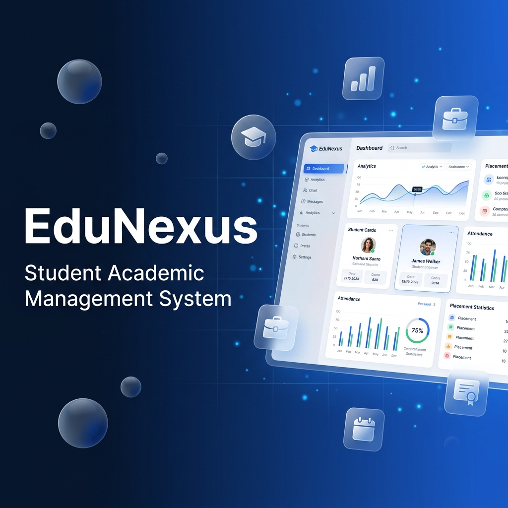
</p>

<!-- ─── Logo ─────────────────────────────────────────────────────────────── -->
<p align="center">
  
</p>

<h1 align="center">🎓 EduNexus — Student Academic Management System</h1>

<p align="center">
  <em>A full-stack, production-grade academic management platform that unifies<br/>
  student records, attendance, examinations, fee tracking, and campus placements<br/>
  into a single, beautiful, role-based dashboard experience.</em>
</p>

<!-- ─── Badges ───────────────────────────────────────────────────────────── -->
<p align="center">
  <!-- Language & Framework -->
  
  
  
  <br/>
  <!-- Frontend -->
  
  
  
  
  <br/>
  <!-- Database & Tools -->
  
  
  
  <br/>
  <!-- Status -->
  
  
  
  
</p>

<p align="center">
  <a href="#-quick-start">Quick Start</a> •
  <a href="#-features-at-a-glance">Features</a> •
  <a href="#-screenshots">Screenshots</a> •
  <a href="#%EF%B8%8F-architecture">Architecture</a> •
  <a href="#-tech-stack">Tech Stack</a> •
  <a href="#-contributing">Contributing</a>
</p>

---

<br/>

<!-- ═══════════════════════════════════════════════════════════════════════════ -->
## 📑 Table of Contents
<!-- ═══════════════════════════════════════════════════════════════════════════ -->

<details open>
<summary><b>Click to expand / collapse</b></summary>

| # | Section | Description |
|---|---------|-------------|
| 1 | [🌟 Project Overview](#-project-overview) | Problem, solution & objectives |
| 2 | [✨ Features at a Glance](#-features-at-a-glance) | Complete feature matrix |
| 3 | [📸 Screenshots](#-screenshots) | Dashboard mockups & UI previews |
| 4 | [🛠️ Tech Stack](#-tech-stack) | Technologies & libraries |
| 5 | [🏗️ Architecture](#%EF%B8%8F-architecture) | System design & data flow |
| 6 | [📁 Folder Structure](#-folder-structure) | Complete project tree |
| 7 | [📦 Project Modules](#-project-modules) | Module-by-module breakdown |
| 8 | [🔄 Workflow](#-workflow) | User journey diagram |
| 9 | [🗄️ Database Schema](#%EF%B8%8F-database-schema) | ER Diagram & table definitions |
| 10 | [📋 Prerequisites](#-prerequisites) | System requirements |
| 11 | [🚀 Quick Start](#-quick-start) | Installation & setup guide |
| 12 | [⚙️ Configuration](#%EF%B8%8F-configuration) | Environment & database config |
| 13 | [🔑 Default Credentials](#-default-credentials) | Demo login accounts |
| 14 | [👥 User Roles & Permissions](#-user-roles--permissions) | Role-based access matrix |
| 15 | [🔒 Security Features](#-security-features) | Authentication & protection |
| 16 | [💡 Project Highlights](#-project-highlights) | Key differentiators |
| 17 | [🗺️ Future Enhancements](#%EF%B8%8F-future-enhancements) | Roadmap |
| 18 | [🤝 Contributing](#-contributing) | Contribution guidelines |
| 19 | [📄 License](#-license) | MIT License |
| 20 | [💬 Support](#-support) | Help & contact |
| 21 | [🙏 Acknowledgements](#-acknowledgements) | Credits |

</details>

---

<br/>

<!-- ═══════════════════════════════════════════════════════════════════════════ -->
## 🌟 Project Overview
<!-- ═══════════════════════════════════════════════════════════════════════════ -->

<table>
<tr>
<td width="50%">

### 🎯 Problem Statement

Educational institutions still rely on fragmented, manual processes for managing academic workflows:

- 📋 **Attendance** tracked on paper registers
- 📝 **Marks** managed in scattered spreadsheets
- 💰 **Fees** tracked through disconnected accounting
- 🏢 **Placements** coordinated via email and WhatsApp
- 📜 **Certificates** processed through offline paperwork
- 📊 **Analytics** are either absent or outdated

This creates **data silos**, **human errors**, **delayed reporting**, and **poor visibility** for administrators, students, and recruiters alike.

</td>
<td width="50%">

### 💡 Our Solution

**EduNexus** is a unified, web-based platform that brings every academic workflow under one roof:

- 🔐 **Role-based dashboards** — Admin, Student & Recruiter portals
- 📊 **Real-time analytics** — Enrollment, attendance & performance charts
- 🎓 **End-to-end academics** — Attendance → Marks → Results → Certificates
- 🏢 **Integrated placements** — Vacancies → Applications → Offers → Letters
- 💰 **Fee management** — Track dues, payments & receipts
- 📢 **Notice board** — Centralized institutional communication

> **One platform. Three portals. Zero paper.**

</td>
</tr>
</table>

### 🎯 Objectives

| # | Objective | Status |
|---|-----------|--------|
| 1 | Digitize student records with CRUD operations | ✅ Complete |
| 2 | Automate subject-wise attendance tracking | ✅ Complete |
| 3 | Manage internal & final examination marks | ✅ Complete |
| 4 | Provide real-time analytics dashboards | ✅ Complete |
| 5 | Integrate campus placement workflow | ✅ Complete |
| 6 | Enable self-service certificate requests | ✅ Complete |
| 7 | Implement fee tracking & payment management | ✅ Complete |
| 8 | Build dedicated company/recruiter portal | ✅ Complete |
| 9 | Centralize institutional notices | ✅ Complete |
| 10 | Auto-seed demo data for instant evaluation | ✅ Complete |

### 🏆 Why EduNexus?

<table>
<tr>
<td align="center">🚀<br/><b>60+ API Routes</b><br/>Comprehensive coverage</td>
<td align="center">🎨<br/><b>40+ Templates</b><br/>Rich, responsive UI</td>
<td align="center">📊<br/><b>Chart.js Analytics</b><br/>Interactive dashboards</td>
<td align="center">🔐<br/><b>3 User Roles</b><br/>Role-based access</td>
</tr>
<tr>
<td align="center">🗄️<br/><b>11 DB Tables</b><br/>Normalized schema</td>
<td align="center">⚡<br/><b>Auto-Migration</b><br/>Zero manual setup</td>
<td align="center">🌱<br/><b>Seed Data</b><br/>Ready to demo</td>
<td align="center">☁️<br/><b>Heroku-Ready</b><br/>Procfile included</td>
</tr>
</table>

---

<br/>

<!-- ═══════════════════════════════════════════════════════════════════════════ -->
## ✨ Features at a Glance
<!-- ═══════════════════════════════════════════════════════════════════════════ -->

<p align="center">
  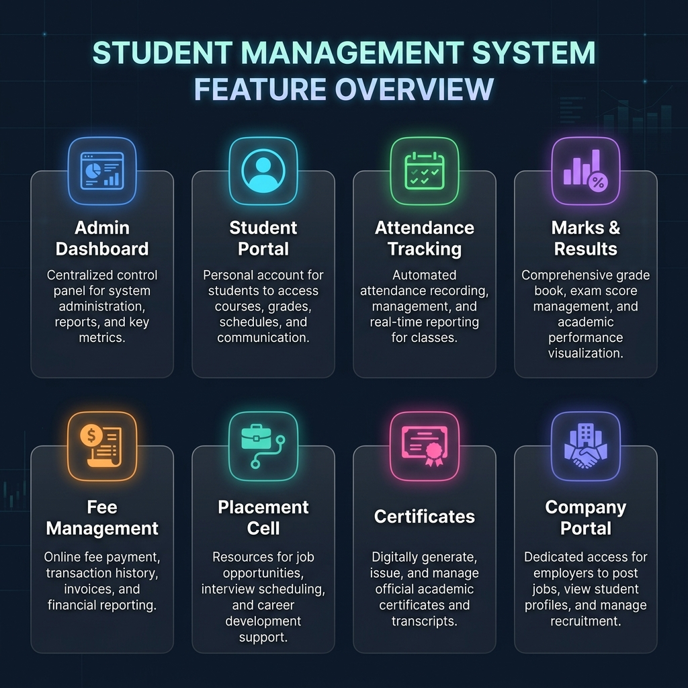
</p>

<details open>
<summary><b>🏫 Student Portal</b></summary>

| Feature | Description | Route |
|---------|-------------|-------|
| 🏠 **Dashboard** | Personalized overview with marks, attendance & placements | `/student_dashboard` |
| 📅 **Attendance Tracker** | Subject-wise attendance % with visual ring charts | `/student_attendance` |
| 📝 **Marks Viewer** | Internal + Final marks with subject breakdown | `/student_marks` |
| 📆 **Timetable** | Weekly class schedule (Mon–Fri) | `/timetable` |
| 💰 **Fee Status** | Outstanding dues, payment history & receipts | `/fees` |
| 📜 **Certificates** | Request bonafide, character & migration certificates | `/certificates` |
| 📢 **Notice Board** | Read institutional notices & announcements | `/notices` |
| 💼 **Placement Cell** | Browse vacancies, apply & track applications | `/vacancies` |
| 📩 **Offer Management** | Accept/reject offers & download offer letters | `/active_offers` |
| 📊 **Results** | Consolidated examination results view | `/results` |

</details>

<details open>
<summary><b>🛡️ Admin Dashboard</b></summary>

| Feature | Description | Route |
|---------|-------------|-------|
| 📊 **Analytics Dashboard** | Enrollment trends, course ratios, performance charts | `/admin` |
| 👨‍🎓 **Student Management** | Add, edit, delete, search student records | `/add_student_page` |
| 📅 **Attendance Management** | Mark daily attendance across 6 subjects | `/attendance` |
| ✏️ **Take Attendance** | Real-time attendance entry with student search | `/take_attendance` |
| 📝 **Internal Marks** | Enter & manage mid-semester examination marks | `/internal_marks` |
| 📝 **Final Marks** | Enter & manage end-semester examination marks | `/final_marks` |
| 📊 **Combined Marks** | View merged internal + final marks per student | `/combined_marks` |
| 💰 **Fee Management** | Create fee records & mark payments | `/admin_fees` |
| 📢 **Notice Board** | Publish, edit & delete notices | `/admin_notices` |
| 📜 **Certificate Approvals** | Review & approve/reject certificate requests | `/admin_certificates` |
| 💼 **Vacancy Management** | Post, edit, close & delete placement vacancies | `/admin/vacancies` |
| 📈 **Advanced Analytics** | Deep-dive analytics with filterable charts | `/analytics` |

</details>

<details open>
<summary><b>🏢 Company / Recruiter Portal</b></summary>

| Feature | Description | Route |
|---------|-------------|-------|
| 📝 **Registration** | Self-service company account creation | `/company_register` |
| 🏠 **Dashboard** | Manage profile, vacancies & applications | `/company_dashboard` |
| 💼 **Post Vacancies** | Create job/internship listings with criteria | `/company/vacancies/add` |
| ✏️ **Edit Vacancies** | Update job details, eligibility & deadlines | `/company/vacancies/edit/<id>` |
| 📋 **Applications** | Review student applications & update status | `/company/applications/update_status` |
| 📩 **Offer Letters** | Send placement offers to selected candidates | — |
| 🔒 **Close Vacancy** | Mark positions as filled | `/company/vacancies/close/<id>` |
| 👤 **Profile Management** | Update company info, HR details & logo | `/company/profile/save` |

</details>

<details>
<summary><b>📊 Reports & Analytics</b></summary>

| Feature | Description |
|---------|-------------|
| 📈 **Enrollment Trends** | Monthly enrollment progression (line chart) |
| 🍩 **Course Distribution** | Student count by course/department (pie chart) |
| 📊 **Subject Performance** | Average marks by subject (bar chart) |
| 📅 **Attendance Reports** | Subject-wise attendance percentage analysis |
| 💼 **Placement Statistics** | Company-wise hiring & offer acceptance rates |
| 💰 **Fee Collection** | Outstanding vs. collected fee analysis |

</details>

---

<br/>

<!-- ═══════════════════════════════════════════════════════════════════════════ -->
## 📸 Screenshots
<!-- ═══════════════════════════════════════════════════════════════════════════ -->

<details open>
<summary><b>🖼️ Click to view all screenshots</b></summary>

<br/>

### 🏠 Landing Page
> *The first screen visitors see — clean, modern login portal with role selection.*

<p align="center">
  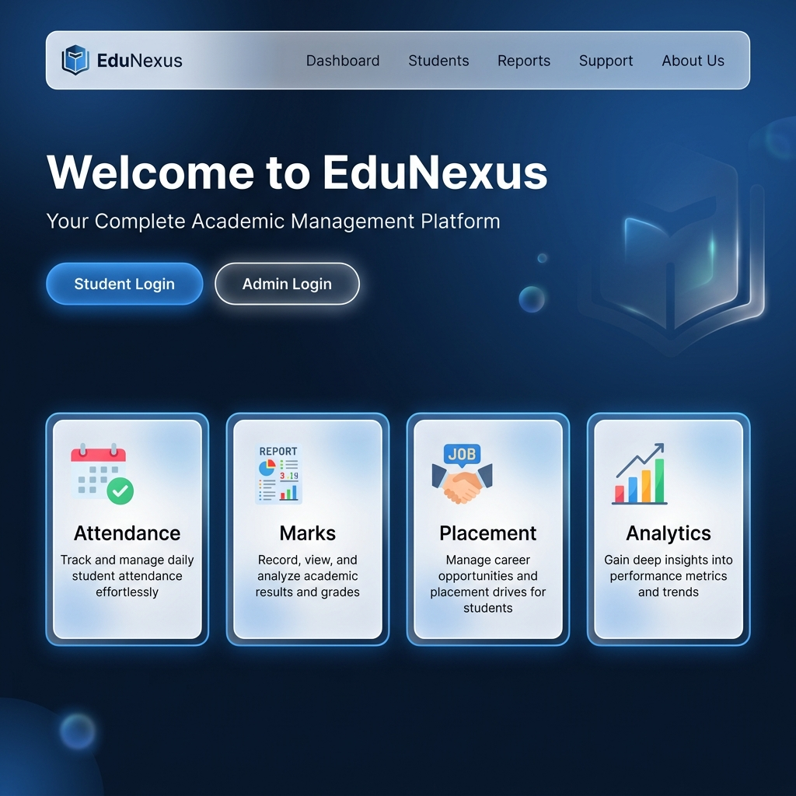
</p>

---

### 📊 Admin Dashboard
> *Real-time analytics with enrollment trends, course distribution, subject performance, and quick-action management cards.*

<p align="center">
  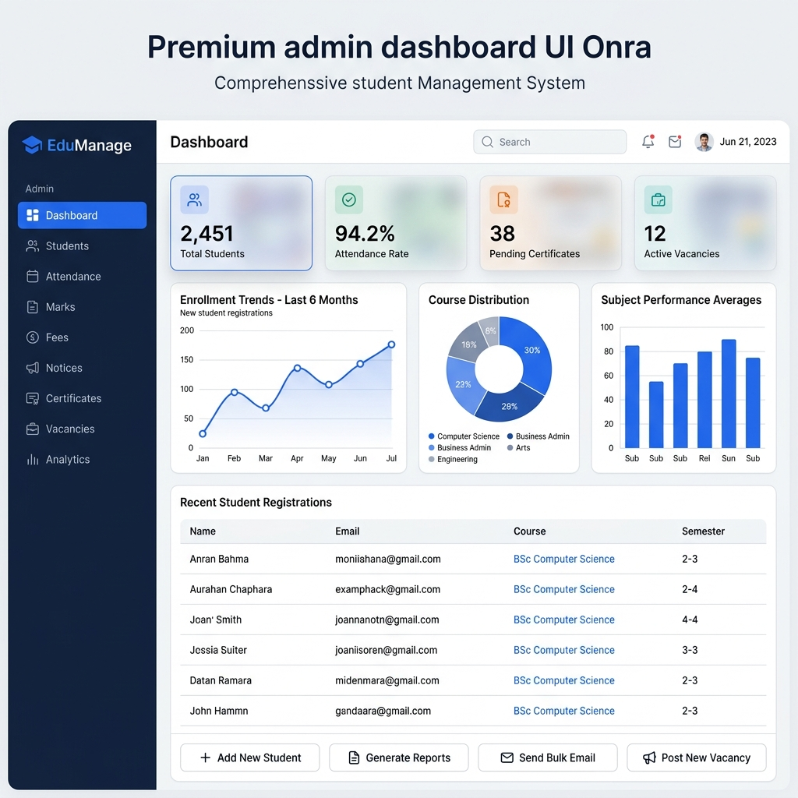
</p>

---

### 🎓 Student Dashboard
> *Personalized academic overview — attendance rings, marks summary, placement opportunities, and notice feed.*

<p align="center">
  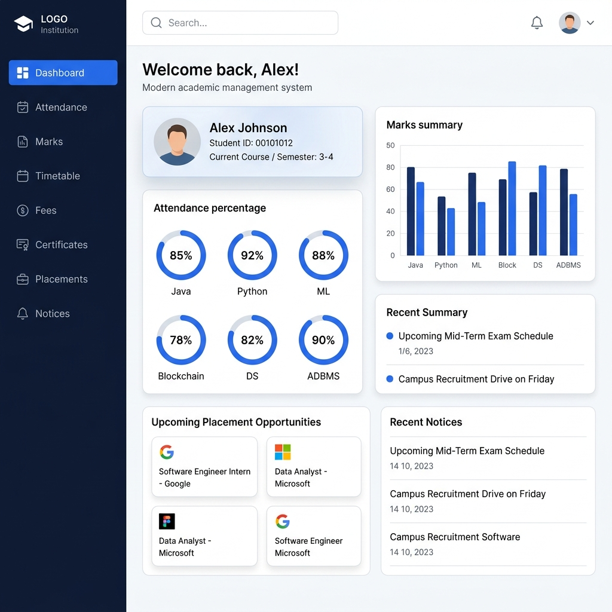
</p>

---

### 🏢 Company / Recruiter Dashboard
> *Vacancy management, application tracking, candidate pipeline, and offer management in one view.*

<p align="center">
  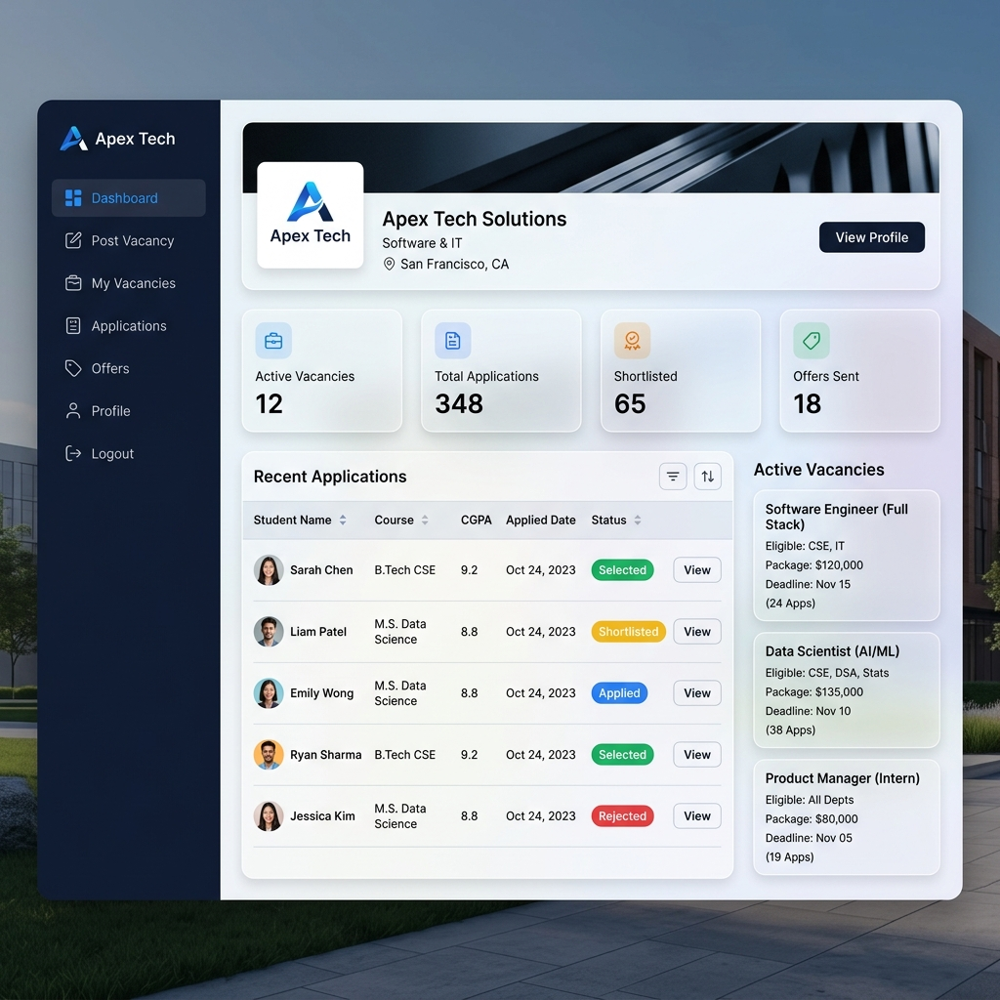
</p>

---

### 📅 Attendance Management
> *Subject-wise daily attendance with real-time percentage tracking and visual indicators.*

<p align="center">
  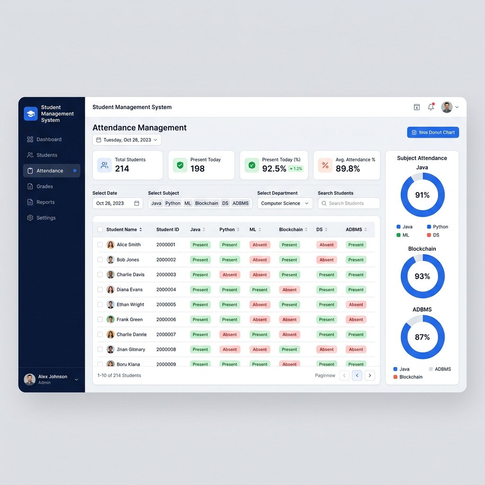
</p>

---

### 📈 Analytics & Reports
> *Interactive Chart.js dashboards with enrollment trends, performance metrics, and placement statistics.*

<p align="center">
  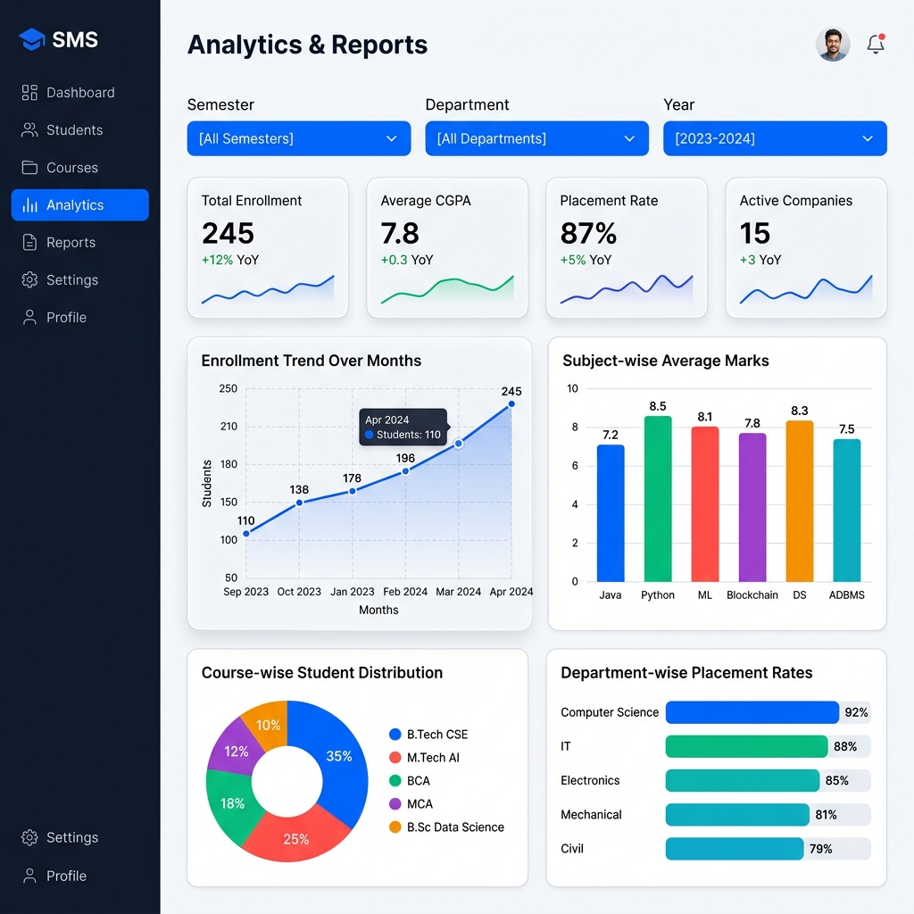
</p>

</details>

---

<br/>

<!-- ═══════════════════════════════════════════════════════════════════════════ -->
## 🛠 Tech Stack
<!-- ═══════════════════════════════════════════════════════════════════════════ -->

<p align="center">
  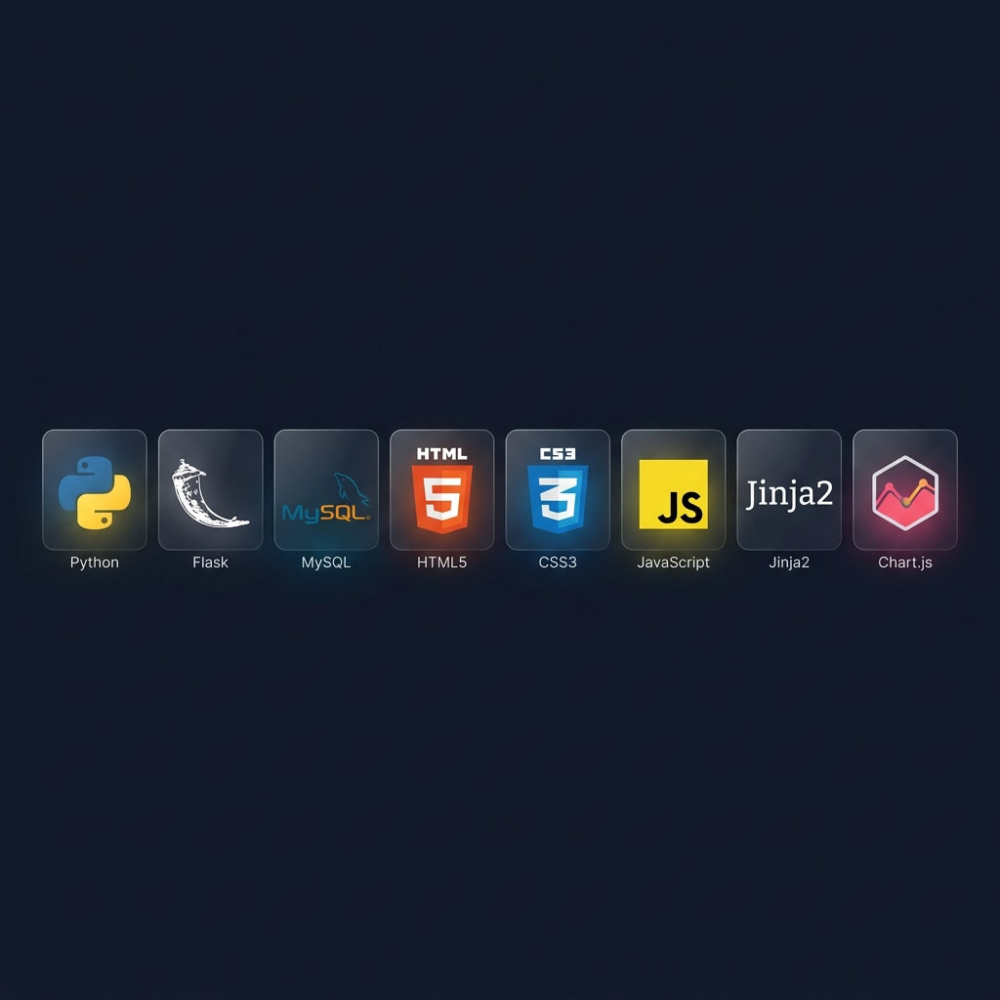
</p>

<table>
<tr>
  <th align="center">Layer</th>
  <th align="center">Technology</th>
  <th align="center">Version</th>
  <th align="center">Purpose</th>
</tr>
<tr>
  <td rowspan="3" align="center"><b>🎨 Frontend</b></td>
  <td> HTML5</td>
  <td>5</td>
  <td>Semantic markup & page structure</td>
</tr>
<tr>
  <td> CSS3</td>
  <td>3</td>
  <td>Custom styling (40K+ lines)</td>
</tr>
<tr>
  <td> JavaScript</td>
  <td>ES6+</td>
  <td>Client-side interactivity & AJAX</td>
</tr>
<tr>
  <td rowspan="3" align="center"><b>⚙️ Backend</b></td>
  <td> Python</td>
  <td>3.10+</td>
  <td>Core application language</td>
</tr>
<tr>
  <td> Flask</td>
  <td>3.x</td>
  <td>WSGI micro web framework</td>
</tr>
<tr>
  <td>🧩 Jinja2</td>
  <td>3.x</td>
  <td>Server-side template engine</td>
</tr>
<tr>
  <td align="center"><b>🗄️ Database</b></td>
  <td> MySQL</td>
  <td>8.0+</td>
  <td>Relational data storage (11 tables)</td>
</tr>
<tr>
  <td rowspan="3" align="center"><b>📚 Libraries</b></td>
  <td>📊 Chart.js</td>
  <td>4.x</td>
  <td>Interactive data visualizations</td>
</tr>
<tr>
  <td>🔌 mysql-connector-python</td>
  <td>Latest</td>
  <td>Python ↔ MySQL interface</td>
</tr>
<tr>
  <td>🔐 python-dotenv</td>
  <td>Latest</td>
  <td>Environment variable management</td>
</tr>
<tr>
  <td rowspan="3" align="center"><b>🔧 Tools</b></td>
  <td> Git</td>
  <td>Latest</td>
  <td>Version control</td>
</tr>
<tr>
  <td> GitHub</td>
  <td>—</td>
  <td>Repository hosting & collaboration</td>
</tr>
<tr>
  <td>☁️ Heroku</td>
  <td>—</td>
  <td>Cloud deployment (Procfile ready)</td>
</tr>
</table>

---

<br/>

<!-- ═══════════════════════════════════════════════════════════════════════════ -->
## 🏗️ Architecture
<!-- ═══════════════════════════════════════════════════════════════════════════ -->

<p align="center">
  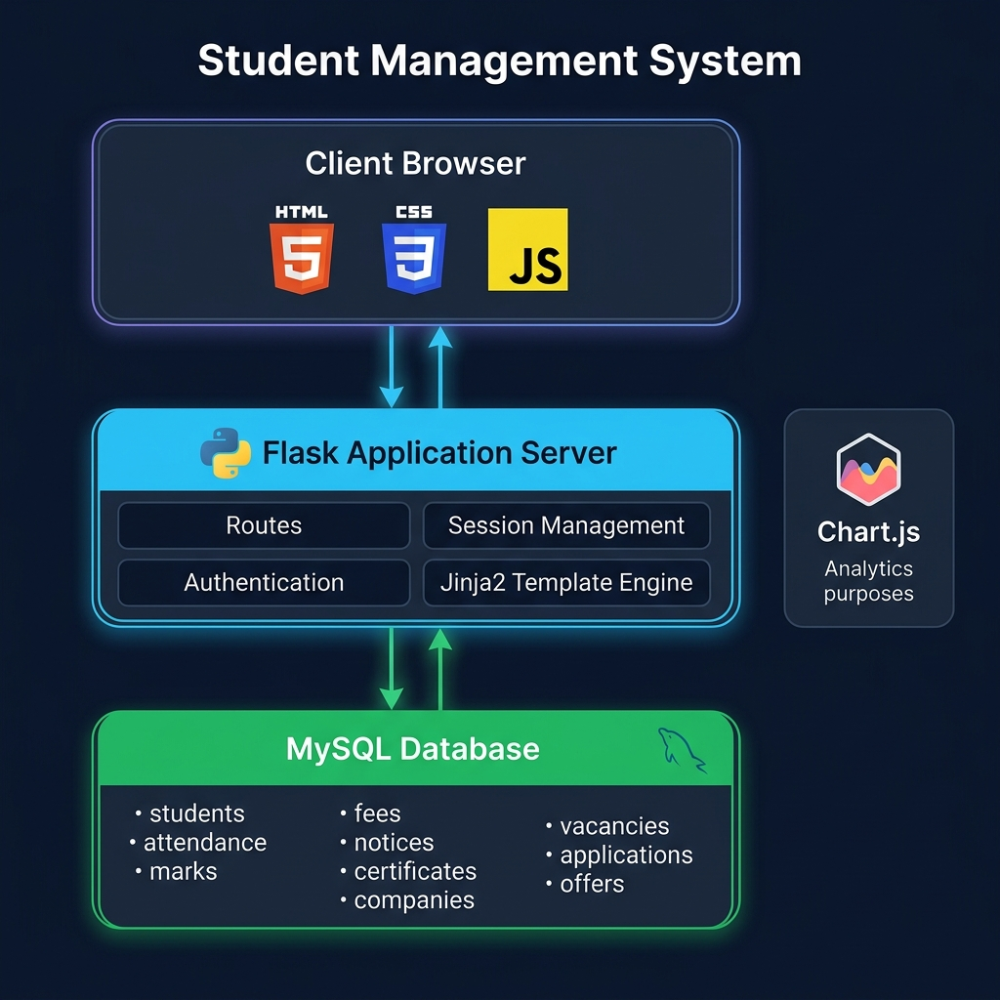
</p>

### System Architecture Diagram

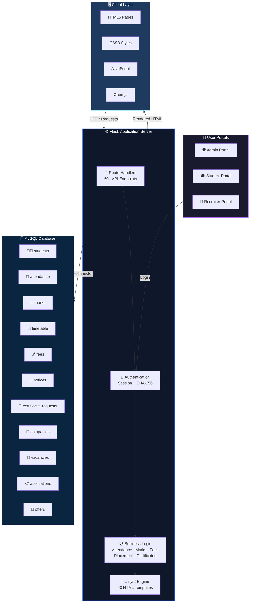
```mermaid
graph TB
    subgraph CLIENT["🖥️ Client Layer"]
        direction LR
        HTML["HTML5 Pages"]
        CSS["CSS3 Styles"]
        JS["JavaScript"]
        CJ["Chart.js"]
    end

    subgraph FLASK["⚙️ Flask Application Server"]
        direction TB
        ROUTES["🔀 Route Handlers<br/>60+ API Endpoints"]
        AUTH["🔐 Authentication<br/>Session + SHA-256"]
        JINJA["📄 Jinja2 Engine<br/>40 HTML Templates"]
        BL["📋 Business Logic<br/>Attendance · Marks · Fees<br/>Placement · Certificates"]
    end

    subgraph DB["🗄️ MySQL Database"]
        direction LR
        S["👨‍🎓 students"]
        A["📅 attendance"]
        M["📝 marks"]
        T["📆 timetable"]
        F["💰 fees"]
        N["📢 notices"]
        CR["📜 certificate_requests"]
        C["🏢 companies"]
        V["💼 vacancies"]
        AP["📋 applications"]
        O["📩 offers"]
    end

    subgraph ROLES["👥 User Portals"]
        direction LR
        ADMIN["🛡️ Admin Portal"]
        STUDENT["🎓 Student Portal"]
        RECRUITER["🏢 Recruiter Portal"]
    end

    CLIENT -->|HTTP Requests| FLASK
    FLASK -->|mysql-connector| DB
    FLASK -->|Rendered HTML| CLIENT
    ROUTES --> AUTH
    AUTH --> BL
    BL --> JINJA
    ROLES -->|Login| AUTH

    style CLIENT fill:#1e3a5f,stroke:#38bdf8,color:#fff
    style FLASK fill:#0f172a,stroke:#2563eb,color:#fff
    style DB fill:#0a2540,stroke:#22c55e,color:#fff
    style ROLES fill:#1a1a2e,stroke:#a855f7,color:#fff
```

### Key Architecture Decisions

| Decision | Rationale |
|----------|-----------|
| **Server-side rendering** | Jinja2 templates for fast initial page load, no SPA complexity |
| **Monolithic controller** | `app.py` (2,875 lines) keeps all logic centralized for simplicity |
| **Session-based auth** | Lightweight cookie sessions — no JWT/token overhead for this scale |
| **Auto-migration** | Tables & columns created automatically on startup — zero manual DDL |
| **Seed data** | Demo companies, vacancies & student accounts auto-populated on first run |
| **SHA-256 hashing** | Industry-standard password security without external auth libraries |

---

<br/>

<!-- ═══════════════════════════════════════════════════════════════════════════ -->
## 📁 Folder Structure
<!-- ═══════════════════════════════════════════════════════════════════════════ -->

<details open>
<summary><b>📂 Click to expand complete project tree</b></summary>

```
📦 studentdata/
│
├── 🐍 app.py                          # Main Flask application (2,875 lines · 60+ routes)
├── ⚙️ config.py                       # Environment config loader (dotenv)
├── 🔍 verify_logins.py                # Login verification & debug utility
├── 📦 requirements.txt                # Python package dependencies
├── 🚀 Procfile                        # Heroku deployment config
├── 🗄️ studentdb.sql                   # Complete MySQL schema + seed data
├── 🔒 .env                            # Environment variables (secrets)
├── 🎨 style.css                       # Root-level fallback styles
├── 📖 README.md                       # This documentation file
│
├── 📂 templates/                      # 🎨 Jinja2 HTML Templates (40 files)
│   │
│   ├── 🔧 Shared Components ─────────────────────────────
│   │   ├── base_head.html             # Common <head> meta, fonts & imports
│   │   ├── topbar.html                # Global top navigation bar
│   │   ├── sidebar.html               # Student portal sidebar nav
│   │   └── admin_sidebar.html         # Admin portal sidebar nav
│   │
│   ├── 🔐 Authentication ────────────────────────────────
│   │   ├── login.html                 # Main login page
│   │   ├── adminlogin.html            # Admin login portal
│   │   ├── student_login.html         # Student login portal
│   │   ├── company_login.html         # Recruiter login portal
│   │   ├── company_register.html      # Company self-registration
│   │   └── register.html              # General registration
│   │
│   ├── 🛡️ Admin Module ──────────────────────────────────
│   │   ├── admin.html                 # Admin main page
│   │   ├── admin_dashboard.html       # Analytics dashboard
│   │   ├── analytics.html             # Advanced analytics
│   │   ├── add_student.html           # Add new student form
│   │   ├── edit_student.html          # Edit student details
│   │   ├── admin_fees.html            # Fee management
│   │   ├── admin_notices.html         # Notice management
│   │   ├── admin_certificates.html    # Certificate approvals
│   │   └── admin_vacancies.html       # Placement management
│   │
│   ├── 🎓 Student Module ────────────────────────────────
│   │   ├── student.html               # Student profile
│   │   ├── student_dashboard.html     # Student main dashboard
│   │   ├── student_attendance.html    # Attendance viewer
│   │   ├── student_marks.html         # Marks viewer
│   │   ├── student_timetable.html     # Timetable viewer
│   │   ├── fees.html                  # Fee status
│   │   ├── notices.html               # Notice board
│   │   ├── certificates.html          # Certificate requests
│   │   ├── vacancies.html             # Placement opportunities
│   │   ├── active_offers.html         # Manage offers
│   │   ├── offer_letter.html          # Offer letter view
│   │   └── results.html               # Exam results
│   │
│   ├── 📝 Academic Management ────────────────────────────
│   │   ├── attendance.html            # Admin attendance view
│   │   ├── take_attendance.html       # Daily attendance entry
│   │   ├── marks.html                 # Marks entry page
│   │   ├── internal_marks.html        # Internal marks form
│   │   ├── final.html                 # Final marks form
│   │   ├── combined_marks.html        # Combined marks report
│   │   └── timetable.html             # Timetable display
│   │
│   ├── 🏢 Company Module ────────────────────────────────
│   │   └── company_dashboard.html     # Recruiter dashboard
│   │
│   └── 📋 Utilities ─────────────────────────────────────
│       └── edit.html                  # Generic edit form
│
├── 📂 static/                         # 🎨 Static Assets
│   ├── 📂 css/
│   │   └── global.css                 # Master stylesheet (40,401 bytes)
│   ├── 📂 js/
│   │   └── chart.js                   # Chart.js visualization library
│   └── 📂 images/
│       └── hero-illustration.svg      # Landing page hero illustration
│
├── 📂 docs/                           # 📖 Documentation Assets
│   └── 📂 images/                     # README screenshots & diagrams
│       ├── hero_banner.png
│       ├── logo.png
│       ├── screenshot_landing.png
│       ├── screenshot_admin_dashboard.png
│       ├── screenshot_student_dashboard.png
│       ├── screenshot_company_dashboard.png
│       ├── screenshot_attendance.png
│       ├── screenshot_analytics.png
│       ├── features_overview.png
│       ├── architecture_diagram.png
│       ├── tech_stack.png
│       └── user_roles.png
│
├── 📂 __pycache__/                    # Python bytecode cache
└── 📂 venv/                           # Virtual environment (not committed)
```

</details>

---

<br/>

<!-- ═══════════════════════════════════════════════════════════════════════════ -->
## 📦 Project Modules
<!-- ═══════════════════════════════════════════════════════════════════════════ -->

<details open>
<summary><b>📋 Click to expand module descriptions</b></summary>

<br/>

### 🎓 1. Student Portal

> The primary interface for enrolled students to access their academic data, track progress, and engage with the placement cell.

| Capability | Details |
|-----------|---------|
| **Dashboard** | Consolidated view with marks summary, attendance rings, placement opportunities, and notice feed |
| **Attendance** | Subject-wise (Java, Python, ML, Blockchain, DS, ADBMS) attendance percentage with color-coded indicators |
| **Marks** | Internal (mid-sem) and Final (end-sem) marks with subject-level detail and combined view |
| **Timetable** | Interactive weekly schedule (Mon–Fri) with subject, time, and break slots |
| **Placements** | Browse company vacancies, check eligibility, apply with one click, and track application status |
| **Offers** | View, accept, or reject placement offers; download offer letters |
| **Certificates** | Request bonafide, character, or migration certificates with priority and reason |
| **Fees** | View semester-wise fee breakdown, due dates, and payment status |
| **Notices** | Read institutional notices categorized by type |

---

### 🛡️ 2. Admin Dashboard

> Complete administrative control panel with analytics, student management, and academic operations.

| Capability | Details |
|-----------|---------|
| **Analytics** | Chart.js-powered dashboards — enrollment trends (line), course ratios (pie), subject averages (bar) |
| **Student CRUD** | Add students with full profile (name, email, course, phone, DOB, gender, address, enrollment no, semester, photo) |
| **Attendance** | Mark attendance for all 6 subjects via student search API, with duplicate detection |
| **Marks Entry** | Separate internal and final marks forms with subject-wise score entry |
| **Fee Management** | Create fee records (tuition, exam, library, hostel) with amounts, due dates; mark as paid |
| **Certificate Approvals** | Review pending requests, approve/reject with status tracking |
| **Notice Board** | Publish notices with title, message, and category; delete outdated notices |
| **Vacancy Management** | Post new vacancies, set eligibility criteria (dept, CGPA, semester), edit/close/delete |

---

### 🏢 3. Recruiter Portal

> Dedicated portal for companies to participate in campus placement drives.

| Capability | Details |
|-----------|---------|
| **Registration** | Self-service sign-up with company details (name, email, phone, website, industry, size, location) |
| **Dashboard** | Overview of active vacancies, application pipeline, and company profile |
| **Vacancy Posting** | Create listings with job title, eligible departments, location, package, job type, vacancy count, CGPA required, skills, deadline |
| **Application Review** | View applicants per vacancy, update status (Applied → Shortlisted → Selected/Rejected) |
| **Profile Management** | Update company info, HR name, logo URL, and company description |

---

### 📊 4. Analytics Engine

> Real-time data visualization powered by Chart.js, rendered from live database queries.

| Chart | Type | Data Source |
|-------|------|-------------|
| Enrollment Trend | Line | Student registration count by month |
| Course Distribution | Doughnut/Pie | `GROUP BY course` on students table |
| Subject Performance | Bar | `AVG()` on marks table (final) |
| Attendance Summary | Ring/Donut | Present/Absent counts per subject |
| Placement Pipeline | Bar | Vacancy → Application → Offer funnel |

---

### 💰 5. Fee Management

> End-to-end fee lifecycle tracking from creation to payment confirmation.

| Stage | Actor | Action |
|-------|-------|--------|
| **Create** | Admin | Add fee record (student, semester, type, amount, due date) |
| **View** | Student | See outstanding fees, amounts, and deadlines |
| **Pay** | Admin | Mark fee as paid with payment date |
| **Report** | Admin | View all fees filtered by status |

---

### 📜 6. Certificate Management

> Digital certificate request and approval workflow.

| Stage | Actor | Action |
|-------|-------|--------|
| **Request** | Student | Submit request (type, reason, priority) |
| **Queue** | System | Added to pending queue with timestamp |
| **Review** | Admin | View pending requests with student details |
| **Process** | Admin | Approve or reject with status update |

</details>

---

<br/>

<!-- ═══════════════════════════════════════════════════════════════════════════ -->
## 🔄 Workflow
<!-- ═══════════════════════════════════════════════════════════════════════════ -->

### User Journey Workflow


```mermaid
flowchart TD
    A["🌐 Landing Page"] --> B{"🔐 Login"}
    
    B -->|Admin Credentials| C["🛡️ Admin Portal"]
    B -->|Student Credentials| D["🎓 Student Portal"]
    B -->|Company Credentials| E["🏢 Recruiter Portal"]
    
    C --> C1["📊 Dashboard & Analytics"]
    C --> C2["👨‍🎓 Student Management"]
    C --> C3["📅 Attendance Entry"]
    C --> C4["📝 Marks Entry"]
    C --> C5["💰 Fee Management"]
    C --> C6["📢 Notice Board"]
    C --> C7["📜 Certificate Approvals"]
    C --> C8["💼 Placement Management"]
    
    D --> D1["🏠 Personal Dashboard"]
    D --> D2["📅 View Attendance"]
    D --> D3["📝 View Marks & Results"]
    D --> D4["📆 View Timetable"]
    D --> D5["💰 Check Fee Status"]
    D --> D6["📜 Request Certificates"]
    D --> D7["💼 Browse & Apply Jobs"]
    D --> D8["📩 Manage Offers"]
    
    E --> E1["🏠 Company Dashboard"]
    E --> E2["💼 Post Vacancies"]
    E --> E3["📋 Review Applications"]
    E --> E4["📩 Send Offers"]
    E --> E5["👤 Manage Profile"]
    
    C1 & C2 & C3 & C4 & C5 -->|Read/Write| F["🗄️ MySQL Database"]
    D1 & D2 & D3 & D4 & D5 -->|Read| F
    D6 & D7 -->|Read/Write| F
    E1 & E2 & E3 & E4 -->|Read/Write| F
    
    F --> G["📊 Reports & Analytics"]

    style A fill:#1e3a5f,stroke:#38bdf8,color:#fff
    style B fill:#7c3aed,stroke:#a855f7,color:#fff
    style C fill:#0f172a,stroke:#2563eb,color:#fff
    style D fill:#0f172a,stroke:#06b6d4,color:#fff
    style E fill:#0f172a,stroke:#22c55e,color:#fff
    style F fill:#0a2540,stroke:#f59e0b,color:#fff
    style G fill:#1a1a2e,stroke:#ec4899,color:#fff
```

### Request-Response Flow

```
 Student/Admin/Company                Flask Server                    MySQL
 ─────────────────────               ─────────────                  ──────
         │                                │                            │
         │── HTTP GET /student_dashboard──►│                            │
         │                                │── SELECT * FROM students──►│
         │                                │◄── Student Record ─────────│
         │                                │── SELECT * FROM marks ────►│
         │                                │◄── Marks Data ─────────────│
         │                                │── SELECT * FROM vacancies─►│
         │                                │◄── Vacancy List ───────────│
         │                                │                            │
         │                                │── Render Jinja2 Template   │
         │◄── HTML Response ──────────────│                            │
         │                                │                            │
```

---

<br/>

<!-- ═══════════════════════════════════════════════════════════════════════════ -->
## 🗄️ Database Schema
<!-- ═══════════════════════════════════════════════════════════════════════════ -->

### Entity Relationship Diagram

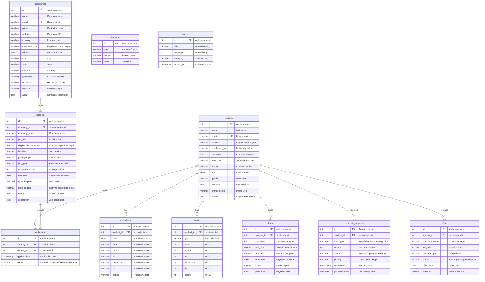
```mermaid
erDiagram
    students ||--o{ attendance : "has"
    students ||--o{ marks : "has"
    students ||--o{ fees : "owes"
    students ||--o{ certificate_requests : "requests"
    students ||--o{ applications : "submits"
    students ||--o{ offers : "receives"
    companies ||--o{ vacancies : "posts"
    vacancies ||--o{ applications : "receives"

    students {
        int id PK "Auto-increment"
        varchar name "Full name"
        varchar email UK "Unique email"
        varchar course "Department/program"
        varchar enrollment_no "University roll no"
        int semester "Current semester"
        varchar password "SHA-256 hashed"
        varchar phone "Contact number"
        date dob "Date of birth"
        varchar gender "M/F/Other"
        text address "Full address"
        varchar profile_photo "Photo URL"
        int marks "Legacy total marks"
    }

    attendance {
        int id PK "Auto-increment"
        int student_id FK "→ students.id"
        date date "Attendance date"
        varchar java "Present/Absent"
        varchar python "Present/Absent"
        varchar ml "Present/Absent"
        varchar blockchain "Present/Absent"
        varchar ds "Present/Absent"
        varchar adbms "Present/Absent"
    }

    marks {
        int id PK "Auto-increment"
        int student_id FK "→ students.id"
        varchar type "internal / final"
        int java "0-100"
        int python "0-100"
        int ml "0-100"
        int blockchain "0-100"
        int ds "0-100"
        int adbms "0-100"
    }

    timetable {
        int id PK "Auto-increment"
        varchar day "Monday-Friday"
        varchar subject "Subject name"
        varchar time "Time slot"
    }

    fees {
        int id PK "Auto-increment"
        int student_id FK "→ students.id"
        int semester "Semester number"
        varchar fee_type "Tuition/Exam/Library"
        decimal amount "Fee amount (INR)"
        date due_date "Payment deadline"
        varchar status "Paid / Unpaid"
        date paid_date "Payment date"
    }

    notices {
        int id PK "Auto-increment"
        varchar title "Notice heading"
        text message "Notice body"
        varchar category "Category tag"
        timestamp posted_on "Publication time"
    }

    certificate_requests {
        int id PK "Auto-increment"
        int student_id FK "→ students.id"
        varchar cert_type "Bonafide/Character/Migration"
        text reason "Request reason"
        varchar status "Pending/Approved/Rejected"
        varchar priority "Low/Medium/High"
        timestamp requested_on "Request time"
        datetime processed_on "Processing time"
    }

    companies {
        int id PK "Auto-increment"
        varchar name "Company name"
        varchar email UK "Unique email"
        varchar phone "Contact number"
        varchar website "Company URL"
        varchar industry "Industry type"
        varchar company_size "Employee count range"
        text address "Office address"
        varchar city "City"
        varchar state "State"
        varchar country "Country"
        varchar password "SHA-256 hashed"
        varchar hr_name "HR contact name"
        varchar logo_url "Company logo"
        text about "Company description"
    }

    vacancies {
        int id PK "Auto-increment"
        int company_id FK "→ companies.id"
        varchar company_name "Company name"
        varchar job_title "Position title"
        varchar eligible_departments "Comma-separated depts"
        varchar location "Job location"
        varchar package_lpa "CTC in LPA"
        varchar job_type "Full-Time/Internship"
        int vacancies_count "Open positions"
        date last_date "Application deadline"
        decimal cgpa_required "Min CGPA"
        varchar skills_required "Comma-separated skills"
        varchar status "Open / Closed"
        text description "Job description"
    }

    applications {
        int id PK "Auto-increment"
        int vacancy_id FK "→ vacancies.id"
        int student_id FK "→ students.id"
        timestamp applied_date "Application time"
        varchar status "Applied/Shortlisted/Selected/Rejected"
    }

    offers {
        int id PK "Auto-increment"
        int student_id FK "→ students.id"
        varchar company_name "Company name"
        varchar job_title "Position title"
        varchar package_lpa "Offered CTC"
        varchar status "Pending/Accepted/Rejected"
        date offer_date "Offer date"
        varchar letter_url "Offer letter URL"
    }
```

### Table Summary

| # | Table | Records | Description |
|---|-------|---------|-------------|
| 1 | `students` | Core | Student profiles, credentials & academic info |
| 2 | `attendance` | Transactional | Daily subject-wise attendance records |
| 3 | `marks` | Transactional | Internal + final marks per student |
| 4 | `timetable` | Reference | Weekly class schedule (Mon–Fri) |
| 5 | `fees` | Transactional | Semester-wise fee records & payment status |
| 6 | `notices` | Content | Institutional notices & announcements |
| 7 | `certificate_requests` | Workflow | Certificate request queue & approvals |
| 8 | `companies` | Core | Registered company/recruiter profiles |
| 9 | `vacancies` | Content | Job/internship listings with criteria |
| 10 | `applications` | Transactional | Student-to-vacancy application records |
| 11 | `offers` | Transactional | Placement offers sent to students |

---

<br/>

<!-- ═══════════════════════════════════════════════════════════════════════════ -->
## 📋 Prerequisites
<!-- ═══════════════════════════════════════════════════════════════════════════ -->

Ensure the following are installed before proceeding:

| Requirement | Minimum Version | Download | Required? |
|-------------|----------------|----------|-----------|
| 🐍 **Python** | 3.8+ (recommended 3.10+) | [python.org](https://www.python.org/downloads/) | ✅ Yes |
| 🗄️ **MySQL Server** | 8.0+ | [mysql.com](https://dev.mysql.com/downloads/mysql/) | ✅ Yes |
| 📦 **pip** | Latest | Bundled with Python | ✅ Yes |
| 🔧 **Git** | Latest | [git-scm.com](https://git-scm.com/downloads) | ✅ Yes |
| 🖥️ **MySQL Workbench** | Latest | [mysql.com](https://dev.mysql.com/downloads/workbench/) | ⬜ Optional |
| 💻 **VS Code** | Latest | [code.visualstudio.com](https://code.visualstudio.com/) | ⬜ Optional |
| 🌐 **Web Browser** | Chrome / Edge / Firefox | — | ✅ Yes |

### System Requirements

| Spec | Minimum | Recommended |
|------|---------|-------------|
| **OS** | Windows 10, macOS 10.15, Ubuntu 20.04 | Windows 11, macOS 13+, Ubuntu 22.04 |
| **RAM** | 4 GB | 8 GB |
| **Disk** | 500 MB | 1 GB |
| **Network** | Required for initial `pip install` | — |

---

<br/>

<!-- ═══════════════════════════════════════════════════════════════════════════ -->
## 🚀 Quick Start
<!-- ═══════════════════════════════════════════════════════════════════════════ -->

### Step 1 — Clone the Repository

```bash
git clone https://github.com/Nitinrajgor07/student-academic-management-system.git
cd student-academic-management-system
```

### Step 2 — Create & Activate Virtual Environment

```bash
# Windows
python -m venv venv
venv\Scripts\activate

# macOS / Linux
python3 -m venv venv
source venv/bin/activate
```

### Step 3 — Install Dependencies

```bash
pip install -r requirements.txt
```

### Step 4 — Set Up MySQL Database

```bash
# Login to MySQL
mysql -u root -p

# Execute the schema file
source studentdb.sql
```

> 💡 **Alternative:** Open `studentdb.sql` in MySQL Workbench and run it.

### Step 5 — Create Database User

```sql
CREATE USER IF NOT EXISTS 'studentuser'@'localhost'
  IDENTIFIED WITH mysql_native_password BY '1234';
GRANT ALL PRIVILEGES ON studentdb.* TO 'studentuser'@'localhost';
FLUSH PRIVILEGES;
```

### Step 6 — Configure Environment

```bash
# Create .env file in project root
echo SECRET_KEY=your_secret_key_here > .env
echo DB_HOST=localhost >> .env
echo DB_USER=studentuser >> .env
echo DB_PASSWORD=1234 >> .env
echo DB_NAME=studentdb >> .env
```

### Step 7 — Run the Application

```bash
python app.py
```

### Step 8 — Open in Browser

```
🌐 http://127.0.0.1:5001
```

> ✅ **First run?** The app automatically creates additional tables (companies, fees, notices, certificates, vacancies, applications, offers) and seeds demo data.

---

<br/>

<!-- ═══════════════════════════════════════════════════════════════════════════ -->
## ⚙️ Configuration
<!-- ═══════════════════════════════════════════════════════════════════════════ -->

<details open>
<summary><b>🔧 Environment & Database Configuration</b></summary>

### `.env` File

| Variable | Default | Description |
|----------|---------|-------------|
| `SECRET_KEY` | `fallback_secret_key` | Flask session encryption key |
| `DB_HOST` | `localhost` | MySQL server hostname |
| `DB_USER` | `studentuser` | MySQL username |
| `DB_PASSWORD` | `1234` | MySQL password |
| `DB_NAME` | `studentdb` | MySQL database name |

### `config.py` Module

```python
import os
from dotenv import load_dotenv

load_dotenv()  # reads values from .env file

class Config:
    SECRET_KEY  = os.getenv("SECRET_KEY", "fallback_secret_key")
    DB_HOST     = os.getenv("DB_HOST", "localhost")
    DB_USER     = os.getenv("DB_USER", "studentuser")
    DB_PASSWORD = os.getenv("DB_PASSWORD", "")
    DB_NAME     = os.getenv("DB_NAME", "studentdb")
```

### Flask App Config

```python
app = Flask(__name__)
app.secret_key = "mysecret123"  # Session encryption
# Runs on port 5001 by default
```

### Debug Mode

Set `debug=True` in `app.run()` for development:
```python
app.run(host="0.0.0.0", port=5001, debug=True)
```

</details>

---

<br/>

<!-- ═══════════════════════════════════════════════════════════════════════════ -->
## 🔑 Default Credentials
<!-- ═══════════════════════════════════════════════════════════════════════════ -->

> ⚠️ **Security Notice:** These are demo credentials for evaluation only. Change all passwords before production deployment.

<details open>
<summary><b>👤 Demo Login Accounts</b></summary>

### 🛡️ Admin

| Field | Value |
|-------|-------|
| Login URL | `http://127.0.0.1:5001/admin_login` |
| Username | `admin` |
| Password | *(configured in database)* |

### 🎓 Students

| # | Name | Email | Password |
|---|------|-------|----------|
| 1 | Rahul | `rahul@gmail.com` | `Rahul@123` |
| 2 | Pulkit | `pulkit22@gmail.com` | `Pulkit@123` |
| 3 | Manav | `manav22@gmail.com` | `Manav@123` |
| 4 | Aum | `aum13@gmail.com` | `Aum@123` |
| 5 | Dixit | `dixit22@gmail.com` | `Dixit@2307` |

### 🏢 Company / Recruiter Accounts

| # | Company | Email | Password |
|---|---------|-------|----------|
| 1 | ABC Technologies Pvt Ltd | `hr@abctecnologies.com` | `Company@123` |
| 2 | NovaTech Solutions Pvt Ltd | `hr@novatechsolutions.in` | `Nova@123` |
| 3 | BrightSoft Technologies | `careers@brightsofttech.com` | `Bright@123` |
| 4 | NextGen Infotech | `hr@nextgeninfotech.in` | `Next@123` |
| 5 | Google India | `careers@google.com` | `Google123` |

</details>

---

<br/>

<!-- ═══════════════════════════════════════════════════════════════════════════ -->
## 👥 User Roles & Permissions
<!-- ═══════════════════════════════════════════════════════════════════════════ -->

<p align="center">
  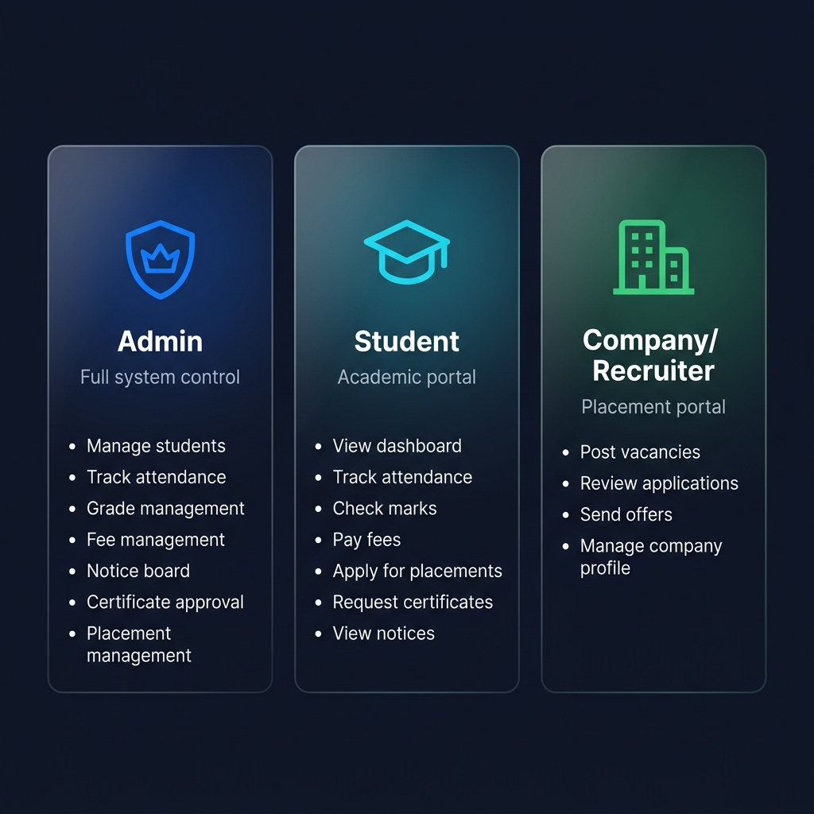
</p>

### Permission Matrix

| Permission | 🛡️ Admin | 🎓 Student | 🏢 Recruiter |
|-----------|:--------:|:----------:|:------------:|
| View Admin Dashboard | ✅ | ❌ | ❌ |
| Manage Students (CRUD) | ✅ | ❌ | ❌ |
| Enter Attendance | ✅ | ❌ | ❌ |
| View Own Attendance | ✅ | ✅ | ❌ |
| Enter Marks | ✅ | ❌ | ❌ |
| View Own Marks | ✅ | ✅ | ❌ |
| Manage Fees | ✅ | ❌ | ❌ |
| View Own Fees | ❌ | ✅ | ❌ |
| Publish Notices | ✅ | ❌ | ❌ |
| Read Notices | ✅ | ✅ | ❌ |
| Approve Certificates | ✅ | ❌ | ❌ |
| Request Certificates | ❌ | ✅ | ❌ |
| Post Vacancies | ✅ | ❌ | ✅ |
| Apply to Vacancies | ❌ | ✅ | ❌ |
| Review Applications | ✅ | ❌ | ✅ |
| Send Offers | ❌ | ❌ | ✅ |
| Accept/Reject Offers | ❌ | ✅ | ❌ |
| View Analytics | ✅ | ❌ | ❌ |
| Manage Company Profile | ❌ | ❌ | ✅ |
| View Timetable | ✅ | ✅ | ❌ |

---

<br/>

<!-- ═══════════════════════════════════════════════════════════════════════════ -->
## 🔒 Security Features
<!-- ═══════════════════════════════════════════════════════════════════════════ -->

| Feature | Implementation | Details |
|---------|---------------|---------|
| 🔐 **Authentication** | Multi-portal login | Separate login flows for Admin, Student, and Company users |
| 🔑 **Password Hashing** | SHA-256 | All passwords hashed with `hashlib.sha256()` before storage |
| 🛡️ **Route Protection** | `@login_required` decorator | Protected routes redirect unauthenticated users to login |
| 🔄 **Session Management** | Flask sessions | Server-side session with `secret_key` encryption |
| 🚫 **Role-Based Access** | Session role checks | Each portal verifies role before granting access |
| 🧹 **Input Validation** | Regex & type checking | Email format, phone number, and marks range validation |
| 🗄️ **Parameterized Queries** | `%s` placeholders | All SQL queries use parameterized statements (no string concatenation) |
| 🔒 **Environment Variables** | `python-dotenv` | Secrets stored in `.env`, never hardcoded in source |

---

<br/>

<!-- ═══════════════════════════════════════════════════════════════════════════ -->
## 💡 Project Highlights
<!-- ═══════════════════════════════════════════════════════════════════════════ -->

<table>
<tr>
<td align="center" width="25%">
  <h3>🎨</h3>
  <b>Modern UI</b><br/>
  40,000+ lines of handcrafted CSS with glassmorphism, gradients & animations
</td>
<td align="center" width="25%">
  <h3>📱</h3>
  <b>Responsive</b><br/>
  Works seamlessly on desktop, tablet & mobile devices
</td>
<td align="center" width="25%">
  <h3>⚡</h3>
  <b>Fast</b><br/>
  Server-rendered pages with no SPA overhead — instant page loads
</td>
<td align="center" width="25%">
  <h3>🔐</h3>
  <b>Secure</b><br/>
  SHA-256 hashing, session guards, parameterized SQL queries
</td>
</tr>
<tr>
<td align="center">
  <h3>👥</h3>
  <b>Role-Based</b><br/>
  Three distinct portals with granular permission control
</td>
<td align="center">
  <h3>📊</h3>
  <b>Analytics</b><br/>
  Interactive Chart.js dashboards with real-time data
</td>
<td align="center">
  <h3>🗄️</h3>
  <b>Dynamic Database</b><br/>
  11 tables with auto-migration on startup
</td>
<td align="center">
  <h3>🌱</h3>
  <b>Ready to Demo</b><br/>
  Auto-seeds companies, vacancies & student accounts
</td>
</tr>
</table>

---

<br/>

<!-- ═══════════════════════════════════════════════════════════════════════════ -->
## 🗺️ Future Enhancements
<!-- ═══════════════════════════════════════════════════════════════════════════ -->

| # | Enhancement | Category | Priority |
|---|-------------|----------|----------|
| 1 | 🤖 **AI-Powered Attendance** — Automated attendance via facial recognition | AI/ML | 🔴 High |
| 2 | 👤 **Face Recognition Login** — Biometric authentication using OpenCV | AI/ML | 🔴 High |
| 3 | 📧 **Email Notifications** — Automated alerts for fees, attendance & placements | Communication | 🟠 Medium |
| 4 | 📱 **SMS Alerts** — Twilio-based SMS for critical notifications | Communication | 🟠 Medium |
| 5 | 📄 **Resume Parser** — AI-powered resume extraction & matching for placements | AI/ML | 🟠 Medium |
| 6 | 🎯 **AI Placement Prediction** — ML model to predict placement probability | AI/ML | 🟡 Low |
| 7 | 📅 **Interview Scheduling** — Calendar integration for placement interviews | Placement | 🟠 Medium |
| 8 | 📱 **Mobile App** — React Native / Flutter companion app | Frontend | 🟡 Low |
| 9 | 📊 **PDF Reports** — Export marks, attendance & certificates as PDF | Reports | 🟠 Medium |
| 10 | 🐳 **Docker Deployment** — Containerized setup with Docker Compose | DevOps | 🟠 Medium |
| 11 | 🧪 **Test Suite** — pytest + coverage with CI/CD pipeline | Quality | 🔴 High |
| 12 | 🔑 **Password Reset** — Email-based password recovery flow | Security | 🔴 High |
| 13 | 📝 **Audit Logging** — Track all admin actions with timestamps | Security | 🟠 Medium |
| 14 | 🌐 **REST API** — Separate API layer for third-party integrations | Architecture | 🟡 Low |

---

<br/>

<!-- ═══════════════════════════════════════════════════════════════════════════ -->
## 🤝 Contributing
<!-- ═══════════════════════════════════════════════════════════════════════════ -->

Contributions are welcome and appreciated! Here's how you can contribute:

### Getting Started

```bash
# 1. Fork the repository on GitHub

# 2. Clone your fork
git clone https://github.com/YOUR_USERNAME/student-academic-management-system.git

# 3. Create a feature branch
git checkout -b feature/amazing-feature

# 4. Make your changes and commit
git add .
git commit -m "feat: add amazing feature"

# 5. Push to your fork
git push origin feature/amazing-feature

# 6. Open a Pull Request on GitHub
```

### Commit Convention

| Prefix | Usage | Example |
|--------|-------|---------|
| `feat:` | New feature | `feat: add PDF report generation` |
| `fix:` | Bug fix | `fix: correct attendance percentage calculation` |
| `docs:` | Documentation | `docs: update API route documentation` |
| `style:` | Formatting | `style: fix CSS alignment in dashboard` |
| `refactor:` | Code restructuring | `refactor: extract DB queries to models` |
| `test:` | Tests | `test: add unit tests for marks module` |
| `chore:` | Maintenance | `chore: update dependencies` |

### Contribution Areas

- 🐛 **Bug Reports** — Found a bug? Open an issue with reproduction steps
- ✨ **Feature Requests** — Have an idea? We'd love to hear it
- 📖 **Documentation** — Help improve guides & API docs
- 🎨 **UI/UX** — Improve the design and user experience
- 🧪 **Testing** — Add unit and integration tests
- 🌐 **Translations** — Help translate the interface

---

<br/>

<!-- ═══════════════════════════════════════════════════════════════════════════ -->
## 📄 License
<!-- ═══════════════════════════════════════════════════════════════════════════ -->

```
MIT License

Copyright (c) 2026 Nitin Rajgor

Permission is hereby granted, free of charge, to any person obtaining a copy
of this software and associated documentation files (the "Software"), to deal
in the Software without restriction, including without limitation the rights
to use, copy, modify, merge, publish, distribute, sublicense, and/or sell
copies of the Software, and to permit persons to whom the Software is
furnished to do so, subject to the following conditions:

The above copyright notice and this permission notice shall be included in all
copies or substantial portions of the Software.

THE SOFTWARE IS PROVIDED "AS IS", WITHOUT WARRANTY OF ANY KIND, EXPRESS OR
IMPLIED, INCLUDING BUT NOT LIMITED TO THE WARRANTIES OF MERCHANTABILITY,
FITNESS FOR A PARTICULAR PURPOSE AND NONINFRINGEMENT.
```

---

<br/>

<!-- ═══════════════════════════════════════════════════════════════════════════ -->
## 💬 Support
<!-- ═══════════════════════════════════════════════════════════════════════════ -->

<table>
<tr>
<td align="center" width="33%">

### 🐛 Bug Reports
Open an issue on GitHub with:
- Steps to reproduce
- Expected behavior
- Actual behavior
- Screenshots (if applicable)

[Open Issue →](https://github.com/Nitinrajgor07/student-academic-management-system/issues)

</td>
<td align="center" width="33%">

### 💡 Feature Requests
Suggest new features via GitHub Issues:
- Describe the use case
- Explain the expected behavior
- Provide mockups (if possible)

[Request Feature →](https://github.com/Nitinrajgor07/student-academic-management-system/issues/new)

</td>
<td align="center" width="33%">

### 📧 Contact
Reach out directly:

**Nitin Rajgor**
- GitHub: [@Nitinrajgor07](https://github.com/Nitinrajgor07)
- Email: *nitinrajgor07@gmail.com*

</td>
</tr>
</table>

---

<br/>

<!-- ═══════════════════════════════════════════════════════════════════════════ -->
## 🙏 Acknowledgements
<!-- ═══════════════════════════════════════════════════════════════════════════ -->

<table>
<tr>
<td>

- 🐍 [**Flask**](https://flask.palletsprojects.com/) — The Python micro web framework that made this possible
- 🗄️ [**MySQL**](https://www.mysql.com/) — The world's most popular open source database
- 📊 [**Chart.js**](https://www.chartjs.org/) — Simple yet flexible JavaScript charting
- 📄 [**Jinja2**](https://jinja.palletsprojects.com/) — The powerful Python template engine
- 🎨 [**Shields.io**](https://shields.io/) — For the beautiful README badges
- 🌐 [**GitHub**](https://github.com/) — For hosting and collaboration
- 📚 All open-source contributors whose libraries power this project

</td>
</tr>
</table>

---

<br/>

<!-- ═══════════════════════════════════════════════════════════════════════════ -->
<!-- CONTRIBUTORS -->
<!-- ═══════════════════════════════════════════════════════════════════════════ -->

## 👨‍💻 Contributors

<table>
<tr>
<td align="center">
  <a href="https://github.com/Nitinrajgor07">
    <br />
    <sub><b>Nitin Rajgor</b></sub>
  </a><br />
  <sub>🏗️ Creator & Lead Developer</sub>
</td>
</tr>
</table>

---

<p align="center">
  
</p>

<p align="center">
  <b>Built with ❤️ by <a href="https://github.com/Nitinrajgor07">Nitin Rajgor</a></b>
</p>

<p align="center">
  If you found this project helpful, please consider giving it a ⭐<br/>
  It motivates me to build more open-source projects!
</p>

<p align="center">
  <a href="#-edunexus--student-academic-management-system">⬆️ Back to Top</a>
</p>